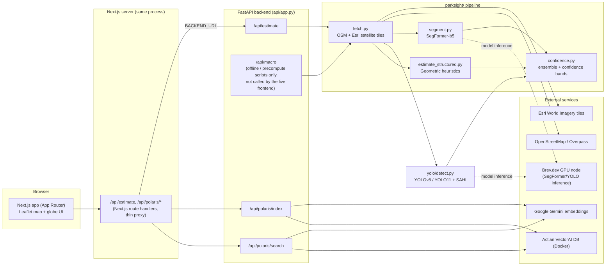
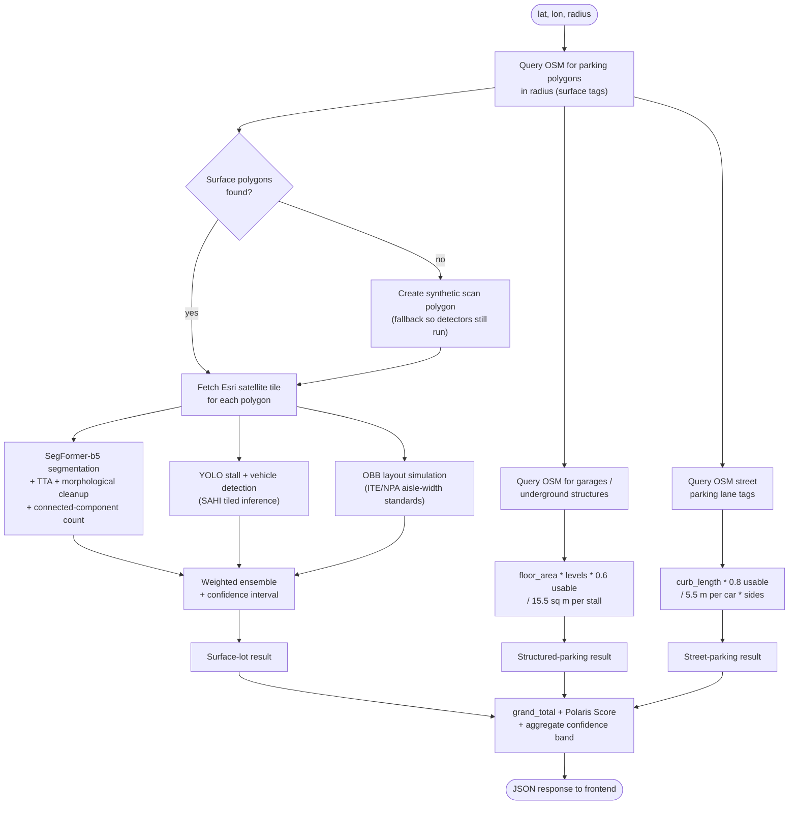
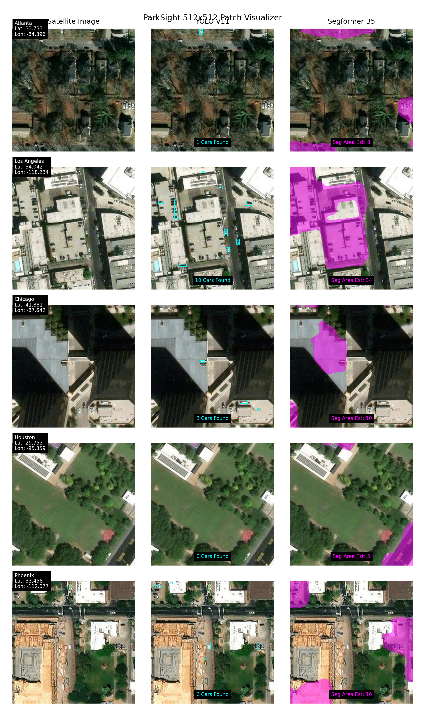
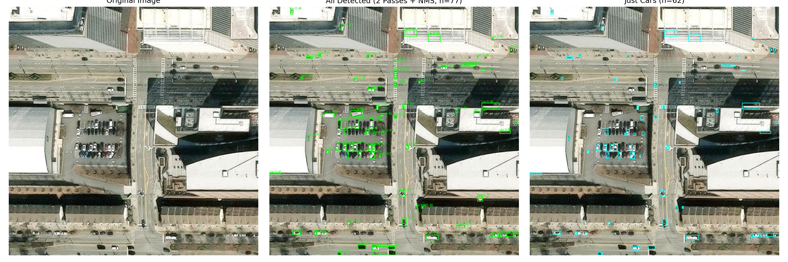

# Polaris - Satellite-Powered Parking Intelligence

Polaris turns a lat/lon into a parking-capacity estimate. Drop a pin anywhere in Atlanta and it pulls satellite imagery plus OpenStreetMap data, runs it through a segmentation model, an object detector, and a geometric heuristic, and returns a stall count with a confidence interval and a composite "Polaris Score" for parking accessibility - covering surface lots, garages, underground structures, and street parking.

**Status:** Hackathon project (built in 36 hours, light polish after). Not deployed long-term; the systemd/Vultr setup described below was used for the demo period and is not guaranteed to be running.

**Winner - GrowthFactor Challenge at [Hacklytics 2026](https://hacklytics-2026.devpost.com/)** (Georgia Tech, Feb 20-22, 2026). [Devpost writeup](https://devpost.com/software/parasite-2dri43).

---

## Table of Contents

- [The Problem](#the-problem)
- [What It Does](#what-it-does)
- [Architecture](#architecture)
- [Estimation Pipeline](#estimation-pipeline)
- [Three Detection Approaches](#three-detection-approaches)
- [Beyond Surface Lots](#beyond-surface-lots)
- [Sample Output](#sample-output)
- [Tech Stack](#tech-stack)
- [Setup](#setup)
- [Usage](#usage)
- [API Reference](#api-reference)
- [Testing / Evaluation](#testing--evaluation)
- [Deployment](#deployment)
- [Known Limitations](#known-limitations)
- [Repository Hygiene Notes](#repository-hygiene-notes)
- [Hackathon Context](#hackathon-context)
- [Contributions](#contributions)
- [License](#license)

---

## The Problem

Retailers and real-estate decision-makers often need to know how much parking exists near a given location. Getting that answer today means manual surveys or stale proprietary datasets. Satellite imagery is abundant and current, but turning raw pixels into an accurate stall count is not a solved problem, and a lot of real-world parking (garages, underground structures, street parking) isn't visible from above at all.

GrowthFactor, a company building software for retail and real-estate decision-makers, sponsored this problem at Hacklytics 2026.

## What It Does

Given a coordinate and a search radius, Polaris returns:

- Surface-lot stall counts from three independent methods (segmentation, object detection, geometry), reconciled into one estimate with a confidence band
- Structured-parking estimates (garages, underground) derived from OSM building metadata, since these aren't visible in satellite imagery
- Street-parking estimates from curb length and OSM lane tags
- A city-wide heatmap mode that runs the same pipeline over an H3 hexagonal grid across Atlanta
- A semantic search endpoint over the indexed grid ("areas with lots of garage parking near restaurants") backed by Gemini embeddings and a vector database

## Architecture



**Uncertainty:** the frontend calls the backend through `BACKEND_URL` (see `src/app/api/*/route.ts`), which in `.env.production` points at a Brev.dev GPU hostname used during the hackathon demo window. Whether that node (or any deployed instance) is still running is unconfirmed - see [Deployment](#deployment).

**Note:** the YOLO+SAHI detector (`yolo/detect.py`, imported by `api/app.py` as `YOLOParkingDetector`) is a separate top-level package, not part of `parksight/`. `parksight/detect.py` also exists but is a different, unused component - see [Three Detection Approaches](#three-detection-approaches).

## Estimation Pipeline

This is the per-request flow inside `/api/estimate` (`api/app.py`), showing how the three detection methods and the "invisible from space" categories combine into one response.



## Three Detection Approaches

### 1. SegFormer-b5 - semantic segmentation

Fine-tuned `nvidia/segformer-b5-finetuned-ade-640-640` on the [ParkSeg12k](https://github.com/UTEL-UIUC/ParkSeg12k) dataset (12,617 satellite image/mask pairs across 45 US cities) for pixel-level parking masks.

- Fetches 512x512 Esri satellite tiles at zoom 19
- Runs inference with test-time augmentation (4 orientations averaged)
- Morphological postprocessing (close, then open, then filter)
- Counts stalls via connected-component analysis with area thresholds (400-12,000 px)
- Falls back to area-based estimation using real-world stall dimensions (15.5 sq m/stall) when connected components aren't separable

Strong at lot-boundary detection and generalizes across geographies; expensive to run and struggles to separate adjacent stalls.

### 2. YOLO - object detection

Two models run in parallel, both using SAHI (Slicing Aided Hyper Inference) to handle small object sizes in satellite tiles:

| Model | Purpose | Dataset |
|-------|---------|---------|
| Custom ParkSeg YOLO | Detect individual parking stalls | Trained on ParkSeg12k + APKLOT |
| YOLOv8s-VisDrone | Detect and count vehicles | Pre-trained on VisDrone aerial dataset |

Note: the vehicle detector named here (YOLOv8s-VisDrone) is the one documented in `short_summary.md`. `api/app.py` loads `models/yolo_aerial_cars.pt` at runtime, and the separate tuning notes in `Benchmark.md` report numbers from a `COCO yolo11n` car detector - different vehicle-detector experiments are referenced across the repo's docs, so figures from different files aren't guaranteed to be the same underlying model.

A slice-size sweep found `256x256` slices with `overlap_ratio=0.4` best in offline evaluation (MAE 6.0 vehicles per region, see [Testing / Evaluation](#testing--evaluation) and `short_summary.md`); this was a tuning result, not the deployed config. The runtime detector (`yolo/detect.py`) uses `128x128` slices with `overlap_ratio=0.25` across a 3-pass test-time-augmentation ensemble (original, inverted, brightened). Fast, and directly counts individual stalls and vehicles; loses precision on densely packed lots.

Implementation note: `parksight/detect.py` also exists in the repo but is an unused Grounding DINO (`IDEA-Research/grounding-dino-tiny`) zero-shot baseline from an earlier iteration, not the detector described above.

### 3. Geometric heuristics - layout simulation

No ML involved. Uses OSM polygon boundaries plus parking-engineering standards:

- OBB-based layout simulation fits parking rows at 45, 60, and 90 degree angles, using angle-specific aisle widths from ITE/NPA standards (7.3m at 90 degrees, 5.5m at 60, 4.0m at 45)
- Aspect-ratio detection switches narrow lots to parallel/single-loaded layouts automatically
- Solidity scoring (convex-hull ratio) penalizes irregular shapes
- Blends with OSM `capacity` tags when present

Near-instant, no GPU needed, accurate for regular lots; weak on irregular shapes without OSM boundary data.

## Beyond Surface Lots

Satellites can't see structured or street parking, so Polaris estimates these from metadata instead:

| Type | Method | Data source |
|------|--------|-------------|
| Parking garages | floor area x levels x 60% usable / 15.5 sq m per stall | OSM `building:levels`, `parking:levels` |
| Underground | Same formula, defaults to 2 levels if the tag is missing | OSM `parking=underground` |
| Street parking | curb length x 80% usable / 5.5m avg car length x sides | OSM `parking:lane`, `parking:left/right/both` |

When an OSM `capacity` tag exists, the estimate is blended (60% OSM + 40% geometric).

## Sample Output

Existing repo images from development/evaluation (not fabricated for this README):

**512x512 patch comparison across five US cities** (`patch_comparisons.png`) - satellite tile vs. YOLOv11 stall/vehicle boxes vs. SegFormer-B5 segmentation mask, side by side:



**Detection overlay on a single tile** (`visual_comparison.png`) - original image, all detections after 2-pass inference + NMS, and vehicles-only:



## Tech Stack

### Backend (Python 3.13+)
- FastAPI + Uvicorn
- SegFormer-b5 (HuggingFace Transformers) for segmentation
- Ultralytics YOLO (v8 + v11) for detection
- OSMnx, GeoPandas, Shapely, PyProj for geospatial queries
- Contextily for Esri World Imagery satellite tiles
- OpenCV, Pillow, NumPy for image processing
- Actian VectorAI DB + Gemini embeddings for semantic search
- TTLCache (in-memory) plus a disk tile cache

### Frontend (TypeScript)
- Next.js 16 (App Router), React 19
- Tailwind CSS 4, Framer Motion, Radix UI, Lucide icons
- Leaflet + React-Leaflet for the map view
- COBE for the WebGL landing-page globe

### Infrastructure (hackathon demo, not guaranteed to still be live)
- GPU inference on a Brev.dev H200 node
- Hosting on a Vultr VPS via systemd services (see `scripts/deploy_vultr.sh`)
- Actian VectorAI DB running in Docker
- Google Gemini (`text-embedding-004` / `gemini-embedding-001`, 768d) for embeddings

## Setup

Prerequisites: Python 3.13+, Node.js 20+ LTS, Docker (optional, only needed for the vector-search feature), and a GPU (CUDA or MPS) if you want SegFormer/YOLO inference at a usable speed - it will run on CPU but slowly.

```bash
git clone https://github.com/V-prajit/Polaris.git
cd Polaris

# Python dependencies
pip install -r requirements.txt
# or with uv:
uv sync

# Frontend dependencies (root package.json is the active Next.js app - see hygiene note below)
npm install
```

Environment variables - copy the template and fill in your own keys, do not commit real values:

```bash
cp .env.production .env
```

```env
GEMINI_API_KEY=YOUR_GEMINI_API_KEY_HERE        # semantic search embeddings
GOOGLE_MAPS_API_KEY=YOUR_GOOGLE_MAPS_API_KEY_HERE  # optional, POI enrichment
BACKEND_URL=http://localhost:8000               # FastAPI backend URL the frontend proxies to
```

Optional - start the vector database for the semantic-search endpoint:

```bash
docker-compose up -d
```

## Usage

Run the API:

```bash
uvicorn api.app:app --host 0.0.0.0 --port 8000 --workers 2
```

Run the frontend:

```bash
npm run dev
```

Open [http://localhost:3000](http://localhost:3000), search for a location, and it returns a parking breakdown for that area. First-run model loading (SegFormer/YOLO checkpoints) adds latency to the first request.

## API Reference

### `GET /api/estimate`

Point-level parking analysis for a single location.

| Parameter | Type | Default | Description |
|-----------|------|---------|--------------|
| `lat` | float | required | Latitude (WGS84) |
| `lon` | float | required | Longitude (WGS84) |
| `radius` | int | 300 | Search radius in metres (50-2000) |

Returns surface lots (stall counts from SegFormer + YOLO + geometry), structured-parking estimates, street-parking estimates, confidence intervals, segmentation-mask contours (GeoJSON), and the Polaris Score.

### `GET /api/macro`

City-wide parking heatmap over an H3 hexagonal grid.

| Parameter | Type | Default | Description |
|-----------|------|---------|--------------|
| `min_lat`, `max_lat` | float | required | Bounding-box latitude |
| `min_lon`, `max_lon` | float | required | Bounding-box longitude |
| `resolution` | int | 9 | H3 grid resolution (9 is roughly 170m-radius hexagons) |

Returns an array of H3 cells, each with a parking-capacity estimate and metadata.

### `POST /api/polaris/search`

Semantic search over the indexed grid.

```json
{
  "query": "areas with lots of garage parking near restaurants",
  "top_k": 10,
  "min_spots": 50,
  "require_garage": true
}
```

Returns the top-K matching hex cells ranked by embedding similarity (Gemini embeddings, Actian VectorAI DB).

`POST /api/polaris/index` and `GET /api/polaris/status` build and check the semantic index; `GET /api/health` is a liveness check.

## Testing / Evaluation

There's no automated test suite (no CI workflow in the repo) - validation was empirical, done during the hackathon against a small set of hand-counted locations.

**Method comparison** (`Benchmark.md`), three Atlanta lots, area heuristic vs. edge detection vs. geometric vs. YOLO spots vs. YOLO cars-via-SAHI:

```
Georgia Tech, Atlanta - Lot #301779 (3,396 sq m)
  Area heuristic:    109  [81-142]
  Geometric:          65  [52-82]
  YOLO spots:         84
  YOLO cars (SAHI):    7  [5-9]

Atlantic Station, Atlanta - Lot #800491500 (6,478 sq m)
  Area heuristic:    208  [156-271]
  Geometric:         122  [97-152]
  YOLO spots:         87
  YOLO cars (SAHI):    2  [1-2]
```

The repo notes that averaging YOLO spot detection with the SegFormer-informed geometric heuristic gave the best results; the other methods served as validation cross-checks, not production inputs.

**Vehicle-detection SAHI tuning** (`short_summary.md`), manual ground-truth counts vs. the VisDrone-pretrained YOLO baseline at two slice configurations:

| Location | Manual count | Baseline (128x128 slices) | Tuned (256x256 slices) |
|----------|:---:|:---:|:---:|
| Atlantic Station | ~55 | 73 | 47 |
| Turner Field Lot | ~27 | 26 | 21 |
| GT Parking | ~34 | 31 | 30 |

Best config: `slice=256x256, overlap=0.4`, MAE 6.0 vehicles/region (down from 7.33 at the default 128/0.3 setting). These numbers are from three hand-counted locations, not a held-out benchmark - treat them as directional, not a rigorous accuracy claim.

## Deployment

`scripts/deploy_vultr.sh` is a one-shot provisioning script for a Vultr VPS: installs Python 3.11, Node 20, and Docker, builds the frontend, starts the Actian VectorAI DB container, and installs two systemd services (`parksight-api`, `parksight-web`) pointed at `uvicorn` and `npm start` respectively. It was used to stand up the hackathon demo; there's no evidence in the repo of it being kept running or monitored afterward, so treat any live URL as unverified.

## Known Limitations

- No automated tests or CI - correctness is checked by manual comparison against hand-counted locations, not a regression suite
- Coverage is effectively Atlanta-only in practice (city-wide H3 indexing and the semantic-search index were built for Atlanta specifically), even though the underlying pipeline takes an arbitrary lat/lon
- SegFormer and YOLO inference is slow without a GPU; the `.env.production` template assumes a remote GPU backend
- Synthetic-scan fallback (when OSM has no surface-lot polygons) is a heuristic circle around the query point, not a real lot boundary, so counts in that mode are rougher
- Structured and street-parking estimates depend entirely on OSM tag completeness/quality; sparse tagging in a given city will understate capacity

## Repository Hygiene Notes

Filed as follow-ups rather than fixed in this PR (docs-only scope):

- The repo is ~2.1GB checked out, most of it three Git LFS model checkpoints (`checkpoints/best_model`, `models/best_model`, `models/segformer_best` - each a SegFormer `model.safetensors`) plus several PNG test outputs and a 6.5MB zoning GeoJSON committed directly (not via LFS). Worth deciding which checkpoint is canonical and whether the others can be dropped.
- There are two parallel Next.js frontends: the root (`src/`, `package.json`, referenced by `deploy_vultr.sh`) is the one actually built and deployed; `frontend/` is an earlier copy from the same hackathon weekend that appears unused by any script. Worth removing or clearly marking as archived.
- `.env.production` is committed. Its values are placeholders/non-secret (API_HOST, CORS_ORIGINS, a Brev.dev hostname) with no live keys, but committing a file named like a real env file is worth avoiding going forward - a `.env.production.example` naming convention is safer.

## Hackathon Context

Built in 36 hours for the ParkSight challenge at [Hacklytics 2026](https://hacklytics-2026.devpost.com/) (Georgia Tech, Feb 20-22, 2026), sponsored by [GrowthFactor](https://www.growthfactor.ai/). The challenge offered two tracks: Track A (point query - estimate capacity near a lat/lon) and Track B (city-wide mapping - map an entire city, weighted more favorably). The team chose Track B and delivered a full city-wide Atlanta map while also supporting point queries.

Data sources used: [ParkSeg12k](https://github.com/UTEL-UIUC/ParkSeg12k) (SegFormer training), [APKLOT](https://github.com/langheran/APKLOT) (YOLO training), [VisDrone](https://github.com/VisDrone/VisDrone-Dataset) (pretrained vehicle detector), Esri World Imagery (satellite tiles via Contextily), OpenStreetMap (parking polygons, building metadata, road networks, capacity tags), and an Atlanta zoning GeoJSON for zoning context.

## Contributions

Built by a three-person team over the hackathon weekend, with one small README follow-up commit two days later. By commit count in this repo: Prajit Viswanadha ([@V-prajit](https://github.com/V-prajit), 48 commits), Jeevanandan Ramasamy ([@JeevanandanRamasamy](https://github.com/JeevanandanRamasamy), 19 commits), Shashank Yaji ([@SSKYAJI](https://github.com/SSKYAJI), 14 commits). Commit counts are a rough proxy, not an exact division of labor.

**Prajit's contributions:** the FastAPI backend and `/api/estimate` / `/api/macro` request pipeline, the OSM fetch and structured/street parking formulas, the geometric OBB layout-simulation heuristic, YOLO + SAHI integration and slice-size tuning, the Gemini-embeddings/Actian vector-search indexing and semantic search endpoint, and the Vultr deployment scripts.

**Team contributions:** SegFormer-b5 fine-tuning and the geometric/solidity-based estimator (Jeevanandan Ramasamy), the Next.js frontend, map dashboard, and UI polish (Shashank Yaji and Jeevanandan Ramasamy).

**Sponsor mentor:** Raj, co-founder at [GrowthFactor](https://www.growthfactor.ai/).

## License

[MIT](LICENSE) - Copyright (c) 2026 GrowthFactor, Inc. (the license file names GrowthFactor as copyright holder; confirm this is intended if the code is meant to be independently reusable outside the hackathon submission).
